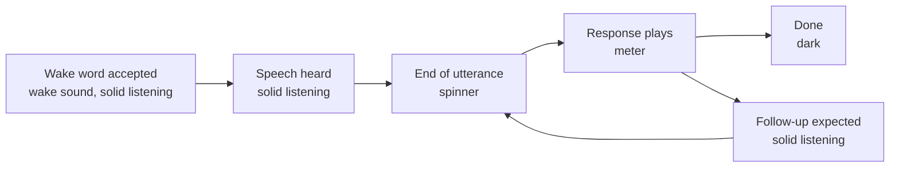

# LED Ring States

The Echo Dot's 12-LED ring and the red LED on the mute button are the only
visual indicators EchoMuse has. This page lists everything the ring can show,
what causes it, which side draws it, and what happens when the controller goes
away.

Two renderers share the ring:

- **The device** draws its own states — privacy mute, the volume arc, a ringing
  alarm or timer, and the link state (offline, awaiting approval). These need
  nothing from the controller and keep working without it.
- **The controller** projects the voice session onto the ring — listening,
  thinking, speaking, waiting for a reply, outcome cues, a running timer, and
  recording modes. It sends `led_anim` (an animation the device renders on its
  own ticker) or `leds` (a fixed 12-LED frame). These are bounded by leases and
  TTLs and are cleared when the controller is lost.

The normative rules are in
[post-afe-audio-architecture.md §11.2](post-afe-audio-architecture.md#112-leds-and-earcons);
the wire messages are in [protocol-v1.md §4.8](protocol-v1.md#48-retained-messages).

## Quick reference

Colours are RGB values sent to the LEDs. Scene colours are for the default
`standard` scene; see [Scenes](#scenes) for the others.

| Ring | Meaning | Drawn by | Survives controller loss |
|---|---|---|---|
| Solid red `(180,0,0)`, mute-button LED on | Microphones off | Device | Yes, and persists across reboot |
| Cyan arc `(0,200,200)`, N of 12 LEDs, 2 s | Volume level after a volume-button press | Device | Yes |
| Cyan pulse `(0,140,220)`, 0.9 s cycle | Alarm or timer ringing | Device | Yes |
| Solid dim cyan `(0,24,38)` | Alarm or timer active but backgrounded while you talk to it | Device | Yes |
| Orange pulse `(200,50,0)`, 2 s cycle | Not connected to the controller | Device | Shown *because of* the loss |
| Grey-white pulse `(80,80,80)`, 2.8 s cycle | Connected, waiting for admin approval | Device | — |
| Solid scene colour (green) | Listening, or waiting for your reply | Controller | No — cleared |
| Spinner (green head and trail) | Thinking: request sent to Home Assistant | Controller | No — cleared |
| Scene colour throbbing with the audio | Speaking a response | Controller | No — cleared |
| One slow throb, 1 s | Heard nothing after the wake word or button | Controller | No |
| Fast blinking, 1 s | Something went wrong | Controller | No |
| Part of the ring lit in scene colour | A Home Assistant timer is running; lit fraction = time remaining | Controller | No — cleared |
| Magenta pulse `(180,0,200)`, 2.6 s cycle | A recording mode is on; voice turns suspended | Controller | No — cleared |
| Dark | Idle | — | — |

## Priority

The device composites the ring from layers. The highest active layer is what
you see:

| Priority | Layer | Code |
|---|---|---|
| 1 (highest) | Volume arc | `device/internal/server/ring.go` `showVolume` |
| 2 | Privacy mute | `device/internal/server/mute.go` |
| 3 | Alert (alarm or timer ringing) | `device/internal/server/server.go` `SetAlertIndication` |
| 4 | Link (offline, awaiting approval) | `device/internal/server/server.go` `SetLinkState` |
| 5 | Controller (`leds` / `led_anim`) | `device/internal/server/server.go` `SetLEDs`, `StartAnim` |
| — | Nothing active | ring dark |

A hidden layer keeps running and keeps its latest frame, so when a higher layer
ends the ring shows the lower layer's current state, not a stale one. Each
layer's animation carries a generation number: a new animation or frame on a
layer replaces the old one atomically, and an old animation can never paint
over its replacement.

Consequences worth knowing:

- **Mute hides everything except the volume arc.** Controller states, a ringing
  alarm and the offline pulse are all hidden behind solid red while muted.
- **A ringing alarm or timer hides the conversation ring.** If you say the wake
  word during an alarm, the ring shows the alert layer (dim cyan while your
  request is handled), not the green listening ring.
- **An alarm that rings while the controller is down shows cyan, not orange.**
  The alert layer outranks the link layer; orange returns when the alarm ends.

## Device-local states

### Privacy mute

Pressing the mute button toggles privacy mute on the device alone. Muting:

- mutes the microphone ADCs in hardware, so the device captures silence and
  the wake detector stops scoring;
- lights the mute-button LED and paints the ring solid red `(180,0,0)`;
- writes the state to `/data/local/etc/echomuse/state.json`, so a reboot or
  firmware update comes back muted;
- reports `privacy.changed` to the controller, which refuses wake and button
  turns while muted.

Unmuting reverses all four; the ring then shows whatever the lower layers
currently hold.

Red is fixed and never changes with the scene; no scene uses pure red. Mute
works with no controller connected at all. After a reboot the red ring appears
once the LED ring initializes (the device waits until 5 s of uptime so the
native boot animation finishes first).

### Volume arc

Each press of volume up or down steps the level by 4 dB and shows a cyan
`(0,200,200)` arc for 2 s. The arc lights LEDs from LED 0 in proportion to the
level across the button range (−40 dB to codec unity): 12 LEDs at maximum, at
least 1 at the bottom of the button range. Level 0 (only reachable by a remote
volume set) lights none.

- The arc is the top layer. While muted it shows over the red ring, which
  returns when the 2 s end. Pressing mute while the arc is showing lights the
  mute-button LED at once; the ring turns red when the arc ends.
- Releasing the action button ends the arc immediately, so a press that starts a
  turn is not hidden behind it.
- During a ringing alarm or timer, volume presses change only that alert's
  volume and the arc shows the alert level.
- Volume set remotely (Home Assistant, dashboard) or restored from
  `startupVolume` shows no arc.

### Alarm or timer ringing

Alarms and timers ring on the device (see
[post-afe-audio-architecture.md §10](post-afe-audio-architecture.md#10-timers-and-alarms-stock-home-assistant)).
While an occurrence is active the alert layer shows:

| Alert state | Ring |
|---|---|
| Foreground (sounding) | Cyan `(0,140,220)` pulse, 0.9 s cycle, 15–100 % brightness |
| Background (silenced while dialog has focus) | Solid dim cyan `(0,24,38)` |
| Ended (stopped, snoozed, dismissed, time limit) | Layer cleared |

An alert goes to the background when dialog takes focus: a wake word spoken
during the ring and the turn that follows it, or a response that is still
playing when the alert falls due (the alert yields for up to 2 s). It returns
to the foreground when the dialog ends, and after
15 s of background time per occurrence the device cancels the dialog and brings
the alert back.

The alert layer is driven entirely by the device's alert executor, so it keeps
working when the controller is down. Stopping it — a tap on the action button,
or the wake word followed by "stop" or "snooze" — clears the layer.

### Offline and awaiting approval

| Link state | Ring |
|---|---|
| Not connected, connecting, or session lost | Orange `(200,50,0)` pulse, 2 s cycle |
| Controller answered `pending_approval` | Grey-white `(80,80,80)` pulse, 2.8 s cycle |
| Controller rejected the device for another reason | Orange pulse |
| Session established (`session.ready`) | Layer cleared |

The orange pulse is set at startup, so a device that has not yet reached the
controller shows orange as soon as the ring initializes. A session is lost after
3 s without any control message from the controller (heartbeats run every
second); the device then clears the controller layer and pulses orange. The 2 s
"degraded" link state is shown on the dashboard only, not on the ring.

Approve pending devices on the dashboard (`DEVICE_APPROVAL=strict`); the pulse
clears when the session opens.

## Controller-driven states

The controller maps each device's session-actor state
(`controller/em_session.py`, states listed in
[post-afe-audio-architecture.md §7](post-afe-audio-architecture.md#7-turn-lifecycle)) onto the
ring in `Device._project_led` (`controller/em_device.py`). The first matching
row wins:

| Condition | Ring | Wire |
|---|---|---|
| A recording mode is on | Magenta `(180,0,200)` pulse, 2.6 s cycle | `led_anim` pulse, TTL 20 s |
| `ARMED`, `LISTENING`, `END_PENDING` | Solid listening palette | `led_anim` solid, TTL 30 s |
| `COMMITTED`, `THINKING` | Thinking spinner, one LED step per 80 ms | `led_anim` spin/rotate, TTL 135 s |
| `SPEAKING` | Playback meter in the meter palette | `led_anim` meter, TTL 20 s |
| A Home Assistant timer is running on this speaker | Timer fraction | `leds` frame |
| Anything else (`IDLE`, `CLOSING`) | Dark | `led_anim` off |

### Voice turns

A typical wake-word turn looks like this:

- **Accepted, no speech yet (`ARMED`).** The controller has accepted the wake
  word or button press and plays the wake sound (`wakeSound`); the ring shows
  the listening palette from that moment.
- **Listening (`LISTENING`, `END_PENDING`).** Solid listening palette while you
  speak, including while the endpoint decision is pending.
- **Thinking (`COMMITTED`, `THINKING`).** Spinner from the end of your utterance
  until the response starts playing. This covers speech-to-text, the Home
  Assistant intent run and fetching the TTS audio.
- **Speaking (`SPEAKING`).** The playback meter (below) while the Home
  Assistant response or an EchoMuse question plays.
- **Expected reply (a reply turn, `ARMED` then `LISTENING`).** When a response
  that continues the conversation, an EchoMuse question such as "Sorry, I
  didn't catch that." or "AM or PM?", or a Home Assistant announcement sent
  with `start_conversation` finishes, a reply turn opens at once, like a
  button press: solid listening palette while the microphone stays open for
  your answer. With `wakeSound` on, the wake sound plays as it opens. If
  nobody answers within 7 s it ends with the ring dark and no cue.

Short terminal lines ("Something went wrong.", "That was too long. Try a
shorter request.", "I'm not sure that worked.", and "Sorry, I didn't catch
that." when no follow-up is allowed) and plain Home Assistant announcements
play with the ring in its idle state. Music and other media never drive the
ring.

### Outcome cues

When a turn ends, the controller may play a one-second cue in the scene's cue
colour (the spinner head colour; the full rainbow in `pride`), then return the
ring to the current state:

| Cue | Look | Sent when |
|---|---|---|
| No speech | One slow throb (0.9 s pulse) | The turn ended with `no_input` — nothing was said after the wake word or button. A follow-up question nobody answered ends without it |
| Error | Fast blinking (0.22 s pulse) | The turn ended `interrupted`, `audio_overrun`, `speech_unavailable`, `ha_timeout`, `response_timeout`, `stt_failed` or `ha_error`; a wake word or button press was refused because the speech worker is unavailable or a recording mode is on; a button press was refused while muted (hidden by the red ring); a spoken line or question could not be fetched or played |

The error reasons `speech_unavailable`, `ha_timeout`, `response_timeout`,
`stt_failed` and `ha_error` are also followed by the spoken line "Something went
wrong." Rhythm, not colour, distinguishes the cues: red, orange and cyan belong
to the device-local states.

### Timer remaining

While at least one Home Assistant timer is running on this speaker and no
conversation or recording mode is active, the idle ring shows how much of the
first timer remains: `ceil(12 × remaining ÷ total)` LEDs, counting from LED 0,
at least 1 while any time remains. The lit LEDs use the scene's listening
palette, LED by LED. "First" is the earliest timer EchoMuse learned about among
those still present; the controller refreshes its timer copy every second from
Home Assistant's timer events.

When the timer finishes it leaves the list, the fraction disappears, and the
device's alert layer takes over with the cyan ring pulse.

### Recording modes

While any of the dashboard's recording modes is on — wake-word sample
collection, ambient recording, or webhook capture — the controller holds a
diagnostic uplink lease, suspends voice turns, and shows the magenta pulse.
Wake words and button presses during a recording mode are refused with the
error cue.

### Leases and controller loss

Controller-driven states cannot outlive the controller:

- **Session loss.** When the device loses the session (3 s of silence, or the
  socket closing), it clears the controller layer and shows the orange pulse.
- **Dialog lease expiry.** When the last dialog focus lease expires on the
  device without being renewed, the device clears the controller layer.
- **Animation TTL.** Every `led_anim` except `off` carries `ttlSec`; if nothing
  replaces the animation in time, the device clears the layer. The controller
  re-sends animations with a TTL of 30 s or less after 10 s without an LED
  update, so the listening ring, meter, timer frame and recording pulse stay up
  for as long as their state lasts. The thinking spinner's 135 s TTL is not
  renewed and bounds how long a single thinking phase can show.
- **Reconnect.** When a session opens, the controller sends the current
  projection again.

Device-local states — mute, volume arc, alarm or timer ringing, link — are not
affected by any of this.

Firmware that predates the capabilities in
[post-afe-audio-architecture.md §11.1](post-afe-audio-architecture.md#111-capability-cutover)
is refused at connect, as is a Dot not running Fire OS 6, so the controller
sends it no ring commands. Move the Dot to Fire OS 6 and provision it with the
wizard ([rooting.md](rooting.md)).

## Scenes

The **Ring** section of a device's (or the global) configuration selects the
palette for the controller-driven states. Changes apply immediately. The
device-local colours — red mute, cyan volume arc, cyan alert, orange and grey
link pulses — are fixed in firmware and do not follow the scene.

| `ledScene` | Listening (solid) | Thinking | Meter and cues |
|---|---|---|---|
| `standard` (default) | Green `(0,180,0)` | Spinner, head `(0,200,0)`, trail `(0,60,0)` | Head `(0,200,0)` |
| `airy` | Sky blue `(80,150,200)` | Spinner, head `(150,205,255)`, trail `(25,45,70)` | Head `(150,205,255)` |
| `malevolent` | Crimson `(110,0,45)` | Spinner, head `(210,45,0)`, trail `(55,8,0)` | Head `(210,45,0)` |
| `pride` | 12-hue rainbow, one hue per LED | The rainbow rotates one LED per 80 ms | Whole rainbow |
| `custom` | `ledListenColor` | Spinner, head `ledThinkColor`, trail at one third of its brightness | Head `ledThinkColor` |

`ledListenColor` and `ledThinkColor` are `#RRGGBB` strings used only by the
`custom` scene (defaults `#00b400` and `#00c800`). An invalid colour falls back
to those defaults; an unknown scene name falls back to `standard`. The
timer-fraction frame uses the listening column.

Code: `controller/em_scenes.py` (`resolve`), dashboard **Ring** section in
`controller/static/dashboard.jsx`.

## Playback meter

While a response plays, the ring brightness follows the level of the audio the
speaker is actually producing. The device measures the RMS of every final-mix
block just before output and renders the meter on its own 40 ms ticker
(`device/internal/server/animator.go`), so it tracks the sound without a
network round trip. The final mix includes everything playing — the response
plus any ducked media underneath it.

Each tick:

1. `level = min(1, rms ÷ ref) ^ curve`
2. The envelope `env` moves toward `level` by the fraction `attack` when rising,
   or `decay` when falling.
3. Brightness `= (floor + (1 − floor) × env) ^ gamma`, applied to the meter
   palette.

The response is tuned with six keys in the **Ring** section (under Advanced on
the dashboard):

| Key | Wire field | Default | Range | Effect |
|---|---|---|---|---|
| `meterAttack` | `attack` | 0.6 | 0.05–1.0 | How fast the ring rises on a peak (fraction of the gap closed per 40 ms tick) |
| `meterDecay` | `decay` | 0.30 | 0.02–1.0 | How fast it falls; 0.30 (about 133 ms) tracks individual syllables |
| `meterFloor` | `floor` | 0.06 | 0.0–0.6 | Perceptual brightness during silence; 0 goes fully dark between words |
| `meterGamma` | `gamma` | 2.2 | 1.0–3.5 | Output contrast; higher expands the dark end and makes the swing more visible |
| `meterRef` | `ref` | 0.22 | 0.02–1.0 | Speaker RMS that maps to full brightness; lower is more sensitive |
| `meterCurve` | `curve` | 0.7 | 0.3–2.0 | Input exponent; below 1 lifts quiet consonants into view |

The controller clamps each value to its range before sending, and the firmware
clamps again, so a bad value cannot produce a dead or strobing ring. A key
missing from the animation uses the firmware default, which matches the table.
For a punchier ring raise `meterDecay` and `meterGamma`; lower them for a
calmer one.

## Animation reference

The device renders these `led_anim` patterns (WIRE §4.8 `anim` object). The
controller uses them for its states; the device uses `pulse` and `solid` for
its own layers.

| Pattern | Colours | Timing |
|---|---|---|
| `off` | — | Clears the layer |
| `solid` | One colour fills the ring, or one colour per LED | Static; optional `ttlSec` |
| `spin` | `[head, trail]`: a lit LED with a dimmer one behind it | `periodMs` per step (default 80 ms) |
| `rotate` | Palette shifted one LED per step | `periodMs` per step (default 80 ms) |
| `pulse` | Palette, brightness 15–100 % on a raised cosine | `periodMs` per cycle (default 2000 ms), 40 ms ticks |
| `meter` | Palette, brightness from the playback level | 40 ms ticks; see [Playback meter](#playback-meter) |

An unknown pattern clears the layer. `leds` sets a fixed frame on the
controller layer, replacing any running controller animation; it has no TTL and
is cleared by session loss, dialog lease expiry, or the next controller update.
